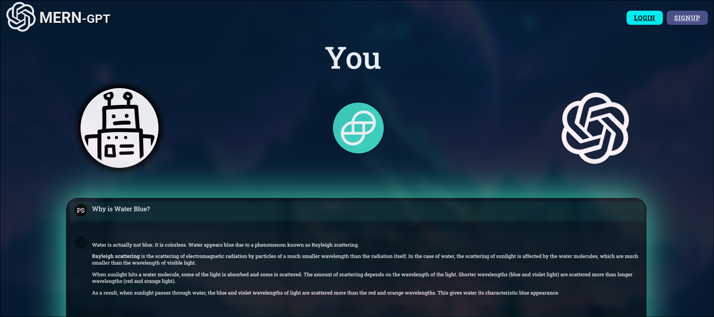
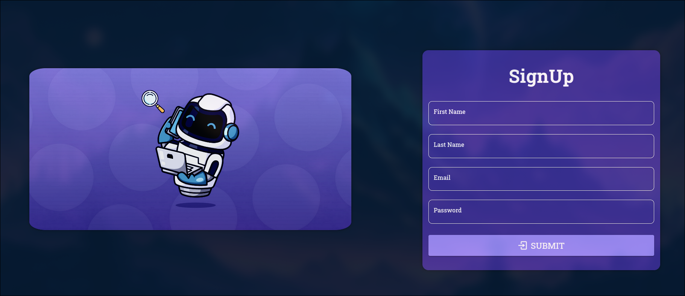
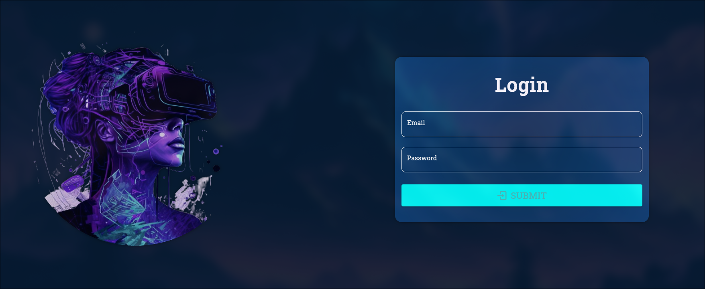
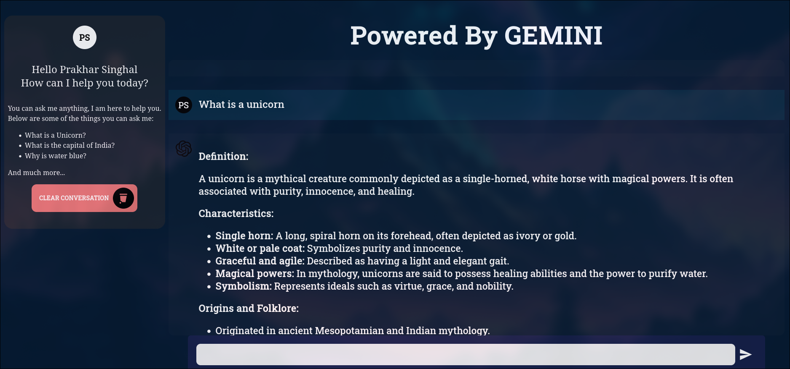
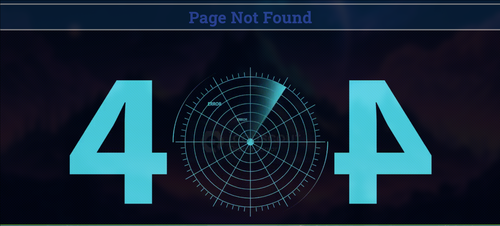

# MERN-GPT
This application is an AI Chatbot built using the MERN Stack and Google Gemini AI API. It takes inspiration from ChatGPT and offers a customized chatbot experience.

One of the key features of this application is the ability to store and retrieve user messages from a database, providing a contextual chatbot experience. The application prioritizes security by implementing various measures such as JWT Tokens, HTTP-Only Cookies, Signed Cookies, Password Encryption, and Middleware Chains.


## Features

- Secure Authentication (JWT Tokens, HTTP-Only Cookies, Signed Cookies)
- Password Encryption
- Middleware Chains
- User Messages Stored in DB (contextual chatbot)
- Customized Chatbot Using Google AI API

## Usage


### Running Backend
For running the backend, you need to have Node.js installed on your system. Also you need to populate the .env file with the following variables:
```text
GOOGLE_GEN_AI_API_KEY="YOUR_GOOGLE_GEN_AI_API_KEY"

MONGODB_USERNAME="your_mongodb_username"
MONGODB_PASSWORD="your_mongodb_password"
MONGODB_URL="your_mongodb_url"

JWT_SECRET = "your_jwt_secret"
COOKIE_SECRET = "your_cookie_secret"

PORT=3000 (or any other port)
```
Place the .env file in the Backend folder.

Then run the following commands in the terminal:

```bash
cd Backend
npm install
npm start
```
This will start the backend server at http://localhost:3000 (or any other port you have specified)

### Running Frontend
For running the frontend, run the following commands in the terminal:

```bash
cd Frontend
npm install
npm run dev
```
This will start the frontend server with output as:
```text
VITE v5.0.12  ready in 178 ms

  ➜  Local:   http://localhost:(port)/
  ➜  Network: use --host to expose
  ➜  press h + enter to show help
```
Open the link (mentioned as Local) in your browser to see the application running.

Note: Reloading page will automatically log you out, as the server will not be able to verify the JWT Token. You need to login again.


## Example
Some screenshots of the application:

Home Page:


Sign Up Page:


Login Page:


Chatbot Page:


Error Page:


## Inspiration
This project is inspired by ChatGPT, and is a customized version of it.

## Contributing
Pull requests are welcome. For major changes, please open an issue first to discuss what you would like to change.

## Note
This is a Personal Project and is not intended for commercial use. 